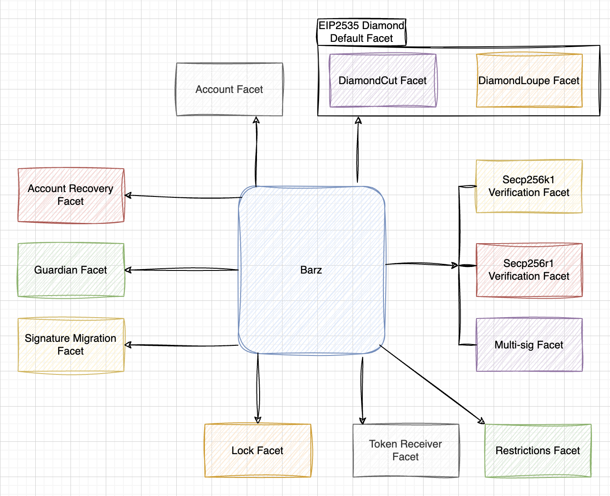

FlorinLacatus Barz

A Secure, Modular, Upgradeable Smart Contract Wallet enabling mass adoption of Web3
```bash
 ________  ________  ________ ________     
|\   __  \|\   __  \|\   __  \\_____  \    
\ \  \|\ /\ \  \|\  \ \  \|\  \|___/  /|   
 \ \   __  \ \   __  \ \   _  _\  /  / /   
  \ \  \|\  \ \  \ \  \ \  \\  \|/  /_/__  
   \ \_______\ \__\ \__\ \__\\ _\\________\
    \|_______|\|__|\|__|\|__|\|__\|_______|                    
```
<!-- TOC -->
- [Barz](#barz)
    - [Architecture](#architecture)
        - [Modularity](#modularity)
            - [Storage](#storage)
            - [Upgrade](#upgrade)
            - [Security](#security)
        - [Architecture Diagram](#architecture-diagram)
        - [Modular Signature](#modular-signature)
    - [Project setup](#project-setup)
        - [Install dependencies](#install-dependencies)
        - [Test contracts](#test-contracts)
        - [Compile contracts](#compile-contracts)
<!-- /TOC -->

## Architecture

### Modularity
Modularity is one of the key principles in software engineering. Modular architecture and code enable high reusability, easy maintainability & testing, lesser interdependency between components, and most importantly provide straightforward purpose and functionality that reduce code bugs and security issues.

Barz also considers Modularity as the key principle across the overall architecture and at the code level.

For modularity, we impose the [EIP-2535 Diamond, Multi-Facet Proxy](https://eips.ethereum.org/EIPS/eip-2535) standard and provide each feature-set in a single facet attached to Diamond(Barz). 
These modules include:
* Account Facet
* Signature Verification Facet
    * Secp256k1 Verification Facet (ECDSA on K1 curve)
    * Secp256r1 Verification Facet (P256 - Passkey)
    * Multi-sig Facet
* DiamondCut Facet
* DiamondLoupe Facet
* Signature Migration Facet
* Restrictions Facet
* Guardian Facet
* Account Recovery Facet
* Lock Facet
* Token Receiver Facet

Each of these modules can be attached and detached by the owner whenever they want.

#### Storage
Barz detaches the storage of each module through `FacetStorage`, and Barz modules will only access the `FacetStorage` the module needs. This reduces the chance of accessing unneeded storage and unwanted modification of storage from modules, especially during implementation upgrade.
With this architecture of detaching the storage each module use, Barz helps prevent each module from having storage collisions which reduces introducing potential vulnerability in proxy pattern.

#### Upgrade
Barz's architecture also provides benefits on upgrades. While the conventional proxy pattern requires upgrading the whole logic implementation to upgrade a part of it, Barz only needs relevant modules to be replaced accordingly, which introduces *Modular Upgradeability* to Accounts.

#### Security
Modular architecture helps to break down the code into smaller modules, which contributes to isolating and limiting the functionality of each module. This helps to reduce the attack surface and limit the potential damage caused by a security breach in a module. This is maximized together with Barz's architecture of only accessing to the storage the module needs.

### Architecture Diagram


### Storage Architecture Diagram


### Modular signature

Unlike other upgradeable architecture which needs an upgrade of the whole logic contract or the whole module containing the feature set, the architecture of Barz supports modular upgradeability for each function, allowing maximum modularity and upgradeability in the wallet contract.

As a form of this, our account contract **"Barz"** supports multiple signature scheme. Users will be able to change the signature scheme very seamlessly with function calls on the account contract.
This enables users to multiple options of wallet UX, for example:

* Users wanting a seamless interaction, and no privateKey back up.
They can use **ECDSA on Secp256r1** signature scheme and use the passkey("WebAuthn") to securely protect their private key in the password manager (e.g., iCloud keychain).

* Users wanting to use the conventional wallet style or hardware wallets might want to use the ECDSA("Secp256k1") signature scheme for signature verification.

*Currently, we are supporting 2 signature schemes(ECDSA on Secp256k1 & Secp256r1 Curve), however, we'll continue to expand our support for multiple different signature schemes including BLS & PQC, etc*

This is enabled by a modular architecture of having signature facets being attached and detached to the account facet according to the preference of the user's regarding the UX each signature scheme could provide.

#### Signature Scheme Update process
During the signature scheme update, the updating function should check the following:
* Check the signature of Owner and Guardians (if exists)
* Check if the new signature facet contract is registered to the Facet Registry
* Initialize the storage of existing signature to 0
* Initialize the storage of new signature to new signer


## Project setup

### Install dependencies
```
yarn
```

### Compile contracts
```
yarn compile
```

### Test contracts
```
yarn test
```

### Check Contract size
```
yarn size
```

### Foundry test
```
forge test
```